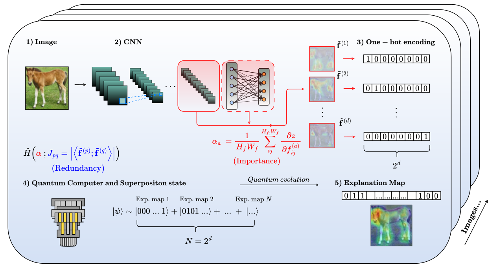

# FS_QA

## Towards interpretable AI with quantum annealing feature selection
This is the code repository from the paper *Towards interpretable AI with quantum annealing feature selection* by Francesco Aldo Venturelli, Emanuele Costa, Sikha O K, Bruno Juliá-Díaz, Miguel A. González Ballester and Alba Cervera-Lierta, that is going to be updated in the next days.


## Abstract
Deep learning models are used in critical applications where mistakes can have serious conse-
quences. Therefore, we must also understand how and why it makes that prediction. This under-
standing helps us check whether the model is learning the right patterns, detect biases in the data,
improve model design, and build systems that we can trust. This work proposes a new method
for interpreting Convolutional Neural Networks in image classification tasks. The approach works
by selecting the most important feature maps that contribute to each prediction. To solve this
combinatorial problem, we encode it into a quantum constrained optimization problem and pro-
pose to solve it using quantum annealing. We evaluate our method against the state-of-the-art
explainable AI techniques, specifically GradCAM and GradCAM++ and observe an improved class
disentanglement, i.e. the model’s decision boundaries become more distinct and its reasoning more
transparent. This demonstrates that our approach enhances the quality of explanations, making
it easier to understand which features the model relies on for specific predictions. In addition, we
study the computational behavior of the quantum annealing algorithm. Specifically, we analyze
the minimum energy gap of the system during computation and the probability that the algorithm
finds the correct solution. These analyses provide theoretical insight into why the method works
effectively in practice.    

  
## Main keypoints
1) After training a CNN (*ResNet-18*), we extract *$N_f$* feature maps from the last convolutional block and we keep only those that positively contribute to the gradient as the following

$$\alpha_a=\frac{1}{H_fW_f}\sum_{ij}^{H_f,W_f}\frac{\partial z}{\partial f^{(a)}_{ij}}                            \\ \\ (1)$$    

$$
\{\tilde{\mathbf{f}}\}\equiv\{\mathbf{f}^{(a)}\mid\alpha_a>0\}
$$    

2) We estimate the cosine similarity (how mutually orthogonal these vectors are)    

$$J_{pq}=| \langle \tilde{\mathbf{f}}^{(p)}; \tilde{\mathbf{f}}^{(q)}\rangle |=\frac{|\sum_{ij} \tilde{f}_{ij}^{(p)} \tilde{f}_{ij}^{(q)}|}{||\tilde{\mathbf{f}}^{(p)}||\  ||\tilde{\mathbf{f}}^{(q)}||}$$    

3) Compose the global time-dependent Hamiltonian (driver $$H_D$$ + problem $$H_P$$)

$$\hat{H}(s) = A(s)\hat{H}_D + B(s)\hat{H}_P$$    

where $$\hat{H}_D = -\sum_p^d \hat{\sigma}_x^{(p)}$$  and  $$\hat{H}_P = (1-\beta)\frac{1}{2}\sum_{pq}J_{pq}\hat{n}_p\hat{n}_q+\beta\sum_ph_p\hat{n}_p.$$


## Structure
```
src -----|
         |
         |---> finalSimulation.py
               run.sh
               sampling.py
               simulation_dimension.py
               utils -----|
                          |
                          |---> feature_extraction_utils2.py
                               loaders.py
                               models.py
                               qutip_class.py
                               qutip_utils.py
```
**finalSimulation.py** performs the annealing evolution using the matrix exponentiation and exact diagonalization (based on Lanczos method) from ```Scipy```of a single
problem Hamiltonian that represents a single image tensor sampled from the set of correct predictions of the test dataset. It stores respectively the bitstring containing the selected feature maps, the energy spectrum, the probabilities, the expectation value of the evolving quantum state, the otheer states of the spectrum and the fidelity in a dedicated folder. Recommend to change folder and global paths.  
**run.sh** executes the file *finalSimulation.py* and-or *simulation_dimension.py* in a loop running on the classes of the dataset.  
**sampling.py** performs the sampling of the ground state bitstring at the end of the annealing evolution.  
**simulation_dimension.py** performs the annealing evolution in the same way *finalSimulation.py* does, with the addition of storing the dimension of the problem Hamiltonian before the annealing evolution, i.e. the number of activated qubits that compose the problem.  
**utils** is a utility folder that contains:  
**feature_extraction_utils2.py** performs the *hook* method of *PyTorch* to extract the feature map from the target convolutional block and calculates the gradient with respect to the 
map itself.  
**loaders.py**

## Authors and contributors
Francesco Aldo Venturelli, Emanuele Costa, Sikha O K, Bruno Julia Diaz, Miguel A. Gonzalez Ballester and Alba Cervera-Lierta.

